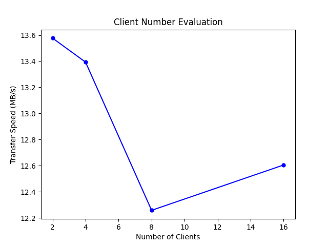
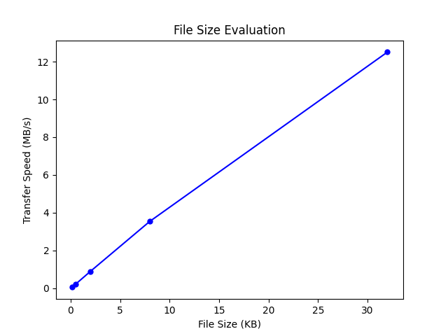

# Evaluation Report

## Evaluation 3 - Client Amount

According to the result graph, we can see that the transfer speed decreased when the number of client increased. That might be an evidence of the server not able to handle that much connections in the same time. Since we create 10 threads for each of the clients, there will be 160 threads connect to the server when ruinng in 16 clients which might exceed the limit of our HTTP server.

## Evaluation 4 - File Size

According to the result graph, we can see that the transfer speed increased when the data size increased. It seems like the evalution I run doesn't exceed the maximum bandwidth, so we got faster transfer speed when we downloads the larger files.
